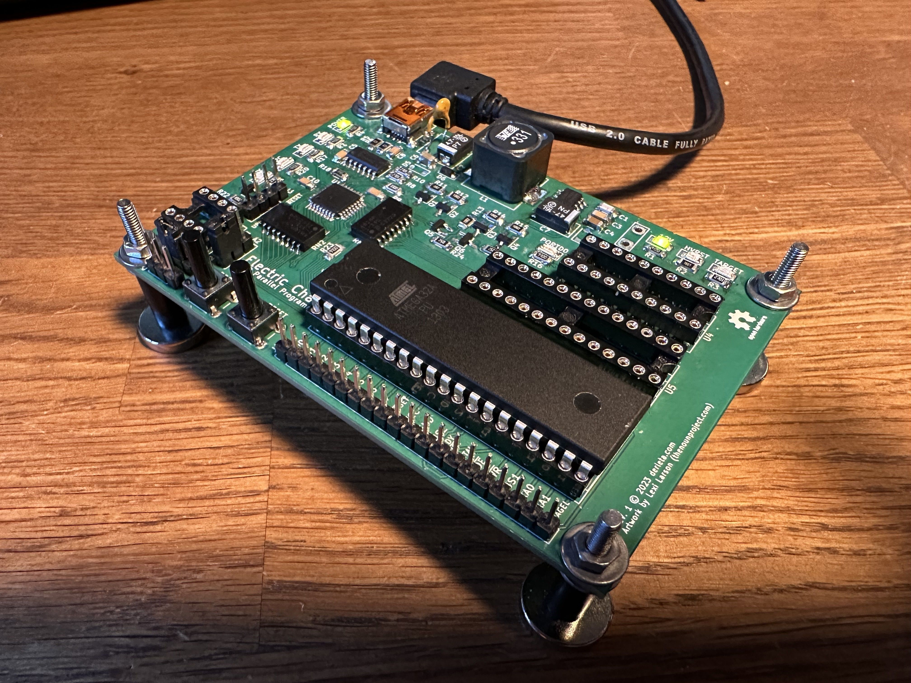

# Electric Chair

AVR Parallel Programmer

## Overview

This is an application of AVRxDB32 MCU with MCP2221A USB-UART/USB-I2C interface chip, implementing parallel programming protocol for ATmega32 and 
other MCUs with similar programming interface. 12V programming voltage is generated onboard by MAX632-based converter.

Firmware stub for AVR128DB32 is available at https://github.com/bderleta/electric-chair-firmware, probably it can be built for other chips from
AVRxDB32 family. The MCP2221A is running at its stock settings and no reconfiguration is necessary, though adjustment of power requirement limit is 
recommended.

## Known flaws of first revision
- Significant USB inrush current (can be adjusted by lowering C2 value, but...)
- Converter input ripple of about 100mV (still testing)
- "12V" and "HVRST" leds are consuming majority of converter's output :)

## Changes coming in second revision

- MAX662-based converter
- XTAL1 line connected to dedicated waveform output of AVR
- PROGRAM button connected to the CCL input in order to enable debouncing using CCL filters
- Elimination of 20-pin socket, instead DIP-40 and DIP-28 ZIF sockets will be placed
